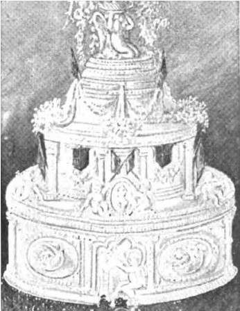
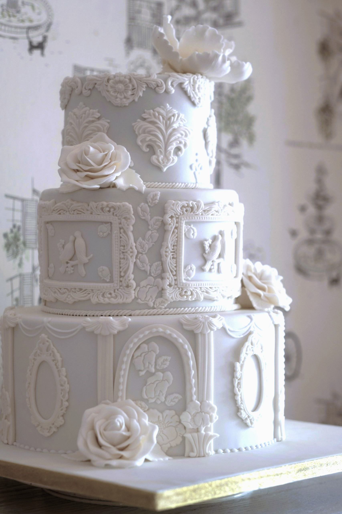
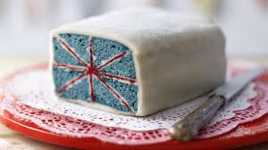

<!DOCTYPE html>
<html lang="en">
<head>
    <meta charset="UTF-8">
    <meta name="viewport" content="width=device-width, initial-scale=1.0">
    <title>Document</title>
    <link rel="stylesheet" href="style.css">
</head>
    
 <button class="navbar-toggler" type="button" data-toggle="collapse" data-target="navbarNavDropdown">
    <aria-controle="navbarNavDropdown" aria-expanded="false" aria-label="toggle navagation">

  </button>
  

    <ul class="navbar-nav">
      <li class="nav-item active">
        <a class= "nav-link" href="index.html"> Home</a>
      </li>
       <li class="nav-item active">
        <a class= "nav-link" href="about.html"> About</a>
      </li>
       <li class="nav-item active">
        <a class= "nav-link" href="order.html"> Order</a>
      </li>
    </a>
  

  
    <h1> About Us</h1>
    
 Stop in for a chat...

    <h1> Our Shop</h1>
    
 Bright, Gleaming and chuck full...

    
    
    
    
    
    

  <h2>Please Take Notice</h2>
  
The following outlines current stock timetables
            
  <table class="table table-bordered">
    <thead>
      <tr>
        <th>Type</th>
        <th>Description</th>
        <th>Timeline</th>
      </tr>
    </thead>
    <tbody>
      <tr>
        <td>Vol Au Vents</td>
        <td>Sweet/Savory</td>
        <td>2 Business Days</td>
      </tr>
      <tr>
        <td>Single Serving</td>
        <td>Sweet/Savory</td>
        <td>2 Business Days</td>
      </tr>
      <tr>
        <td>Whole Bakes</td>
        <td>Sweet</td>
        <td>3 Business Days</td>
      </tr>
    </tbody>
  </table>
 

    <h1> Bespoke is our Passion...</h1>
    
 Deeper appreciation for authentic expression...

  <h2>Please Take Notice</h2>
  
The following outlines current Bespoke timetables
            
  <table class="table table-bordered">
    <thead>
      <tr>
        <th>Tiers</th>
        <th>Description</th>
        <th>Timeline</th>
      </tr>
    </thead>
    <tbody>
      <tr>
        <td>1</td>
        <td>Casual/Formal</td>
        <td>2 Business Days</td>
      </tr>
      <tr>
        <td>2-3</td>
        <td>Formal</td>
        <td>10 Business Days</td>
      </tr>
      <tr>
        <td>4+</td>
        <td>Formal</td>
        <td>Fortnight</td>
      </tr>
    </tbody>
  </table>
 

</body>
</html>

<!DOCTYPE html>
<html lang="en">
<head>
    <meta charset="UTF-8">
    <meta name="viewport" content="width=device-width, initial-scale=1.0">
    <title>Document</title>
    <link rel="stylesheet" href="style.css">
</head>
<body style="background-color: azure;">

   <button class="navbar-toggler" type="button" data-toggle="collapse" data-target="navbarNavDropdown">
    <aria-controle="navbarNavDropdown" aria-expanded="false" aria-label="toggle navagation">

  </button>
  

    <ul class="navbar-nav">
      <li class="nav-item active">
        <a class= "nav-link" href="index.html"> Home</a>
      </li>
       <li class="nav-item active">
        <a class= "nav-link" href="about.html"> About</a>
      </li>
       <li class="nav-item active">
        <a class= "nav-link" href="order.html"> Order</a>
      </li>
    </a>
  

  

  <h2>Bespoke Inquiry</h2>
  <form action="/action_page.php">
    

      <label for="email">Email:</label>
      <input type="email" class="form-control" id="email" placeholder="Enter email" name="email">
    

    

      <label for="pwd">First Name</label>
      <input type="first name" class="form-control" id="name" placeholder="">
    

     

      <label for="pwd">Surname</label>
      <input type="last name" class="form-control" id="name" placeholder="">
    

     

      <label for="pwd">Bespoke Inspiration Comments</label>
      <input type="comment" class="form-control" id="text" placeholder="">
    

    

      <label class="form-check-label">
        <input class="form-check-input" type="checkbox" name="past"> Existing Client with account
      </label>
    

    <button type="submit" class="btn btn-primary">Submit</button>
  </form>

</html>

<!DOCTYPE html>
<html lang="en">
<head>
    <title>Document</title>

    <meta charset="UTF-8">
    <meta name="viewport" content="width=device-width, initial-scale=1.0">
      <link rel="stylesheet" href="style.css">
        
  
  
</head>
<body class="container">
<nav class="navbar navbar-expanded-sm navbar-kight bg-light">
  
  <button class="navbar-toggler" type="button" data-toggle="collapse" data-target="navbarNavDropdown">
    <aria-controle="navbarNavDropdown" aria-expanded="false" aria-label="toggle navagation">

  </button>
  

    <ul class="navbar-nav">
      <li class="nav-item active">
        <a class= "nav-link" href="index.html"> Home</a>
      </li>
       <li class="nav-item active">
        <a class= "nav-link" href="about.html"> About</a>
      </li>
       <li class="nav-item active">
        <a class= "nav-link" href="order.html"> Order</a>
      </li>
    </a>
  

  

</nav>

  
 

    <h1>Loll Ferris Fine British Patisserie</h1>
     <h2> 515 North Lake Grove</h2>
     <h2> Saint Lake Elmo, MN 55110</h2>
     <h2>651.731.5362</h2>

     <h4>Loll Ferris, Properiter</h4>

</body>

</html>

   body {
        font-family:'Trebuchet MS', 'Lucida Sans Unicode', 'Lucida Grande', 'Lucida Sans', Arial, sans-serif;
        background-color: azure;
        color: darkcyan;
    }

    h1 {
        color:cadetblue;
    }

    h2 {
        color:cadetblue;
        margin: 10px;
    }

    h4 {
        color:cadetblue;
    }

    body {
  margin: 25px;
  padding: 25px;
}

h2, p {
  margin-top: 1em;
  margin-bottom: 1em;
}

ul {
  list-style-type: none;
  padding: 5px;
  overflow: hidden;
  background-color: #a8d2da;
}

ul li {
  float: left;
}

ul li a {
  display: block;
  color: rgb(44, 101, 138);
  text-align: center;
  padding: 14px 16px;
  text-decoration: none;
}

ul li a:hover {
  background-color: #6ea8db;
}

